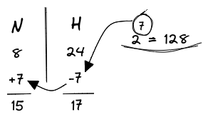
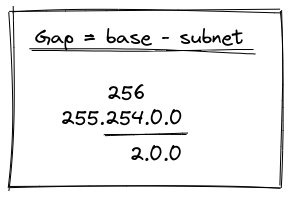
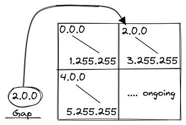
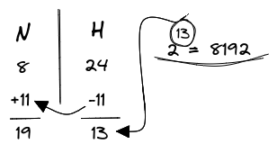
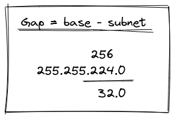
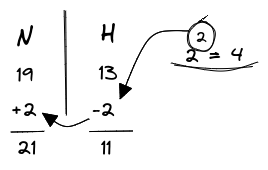
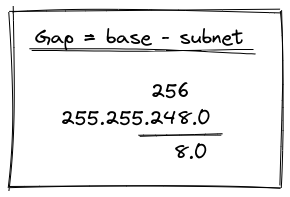
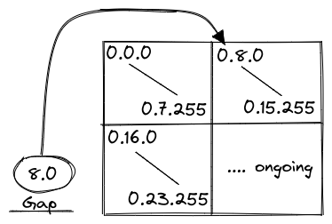

- **eg. 1**:  

> Number of needed subnets = 128  
> Network Address = 17.0.0.0/8

{width: 30%, float: right}  

Converting the required subnet as power of 2.  
We will get $2^7 = 128$.  

Now, using the bit (power) value we reduce **H** bits by 7 bits giving us 17 **H** bits and increase **N** bits by the same giving 15 **N** bits.  

{width: 30%, float: right}  

The subnet for 27 **N** bits is `255.254.0.0`  

Now using the gap method, and subtracting those subnet value that hasn't been completed by the base value, will give us the gap value.  

Now we can just use the gap value as initial **H** bits for 2nd block gives us hosts for all blocks.  

{width: 40%, display: block}  

 

- **eg. 2**:  

> Number of needed usable hosts = 8000  
> Network Address = 17.0.0.0/8

{width: 30%, float: right}  

Calculating for 8000 hosts, we will have to reduce our **H** bits by 11 to get 13 **H** bits (equals to 8192 hosts).  
Then increasing the **N** bits by the same will give us 19 **N**.  

The subnet for 19 **N** bits is `255.255.224.0`  

{width: 30%, float: right}  

To find the initial subnet bit value for our blocks, we will use the gap method. Subtracting those subnet value that hasn't been completed by the base value, will give us the gap value.  

Now we can just use the gap value as initial **H** bits for 2nd block gives us hosts for all blocks.  

{width: 40%, display: block}  

### Subnet of subnet  

- **eg. 3**:  

> Divide the initial 8000 hosts from example-2 into 4 subnets.  
>
> Number of needed usable hosts = 8000  
> Network Address = 17.0.0.0/19

{width: 30%, float: right}  

Converting the required subnet as power of 2.  
We will get $2^2 = 4$.  

Now, using the bit (power) value we reduce **H** bits by 2 bits giving us 11 **H** bits and increase **N** bits by the same giving 21 **N** bits.  

{width: 30%, float: right}  

The subnet for 21 **N** bits is `255.255.248.0`  

Now using the gap method, and subtracting those subnet value that hasn't been completed by the base value, will give us the gap value.  

Now we can just use the gap value as initial **H** bits for 2nd block gives us hosts for all blocks.  

{width: 40%, display: block}  
