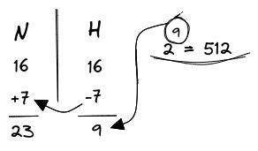
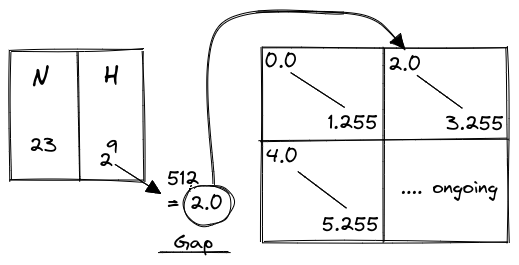
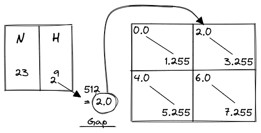

- **eg. 1**:  

> Number of needed usable hosts = 500  
> Network Address = 150.10.0.0/16  

{width: 30%, float: right}  
CLass B provides us with 16 **N** bits and 16 **H** bits. Calculating for 500 hosts, we will have to reduce our **H** bits by 7 to get 9 **H** bits (equals to 512 hosts).  
Then increasing the **N** bits by the same will give us 23 **N**.  

{width: 40%, float: right}  

The subnet for 23 **N** bits is `255.255.254.0`  
To find the initial subnet bit value for our blocks, we will use the gap method. Subtracting those subnet value that hasn't been completed by the base value, will give us the gap value.  

Now we can just use the gap value as initial **H** bits for 2nd block gives us hosts for all blocks.  

{width: 50%, display: block}  
