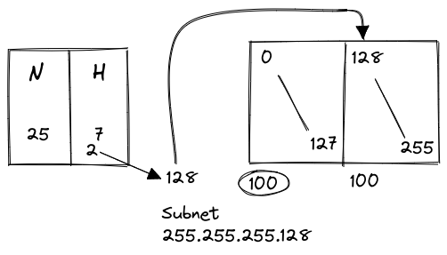
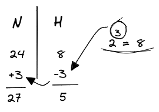
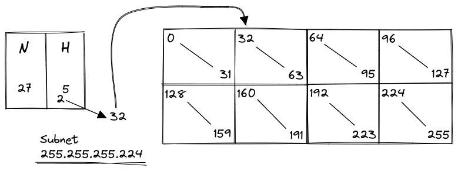
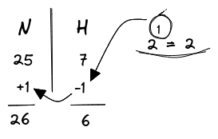
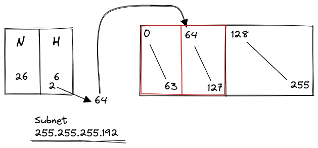

Dividing a network into smaller parts...  

### Class C with hosts requirements  

- **eg. 1**:  

> Number of needed usable hosts = 100  
> Network Address = 192.168.1.0/24  

Here in class C ,  
**N** bits are 24 and **H** bits are 8.  
{width: 35%, float: right}

8 **H** bits provide $2^8$ that is 256 host addresses. To fulfill the requirement of 100 hosts in a subnet, we will only be using 7 **H** bits i.e 128 hosts.  

So, reducing **H** by 1 bit to get 7 **H** bits and then increasing the **N** by 1 bit gives us 25 **N** bits.  

The [[networking.subnetting.subnet-mask]] for /25 or 25 **N** bits is `255.255.255.128`  
Dividing 256 bits into subnet blocks and assigning resulting **H** addresses as initial for 2nd block gives us required hosts for only 2 blocks.

{width: 50%, display: block}  

 

- **eg. 2**:  

> Number of needed usable hosts = 50  
> Network Address = 192.150.10.0/24  

We have 8 **H** bits i.e 256 host addresses, for the required 50 hosts so we can use 6 **H** bits (i.e 64 hosts) per subnet.  
{width: 35%, float: right}  

So, reducing **H** by 2 bit to get 6 **H** bits and then increasing the **N** by the same gives us 26 **N** bits.  
Subnet for 26 **N** is `255.255.255.192`  

Now, we can put the value for 6 **H** bits (64 hosts) as our initial value in the 2nd subnet (quadrant), and calculate values for other subnets based on the differences.  

### Class C with subnet requirements  

- **eg. 3**:  

> Number of needed subnets = 8  
> Network Address = 200.1.1.1/24  
  
When we are just required to divide the subnet without any requirements for hosts, we will take the required subnets and convert it as power of 2.  
We know that 3 bits gives us 8 subnets i.e $2^3 = 8$.  
{width: 35%, float: right}  

Now, using the bit value we reduce **H** bits by 3 bits giving us 5 **H** bits and increase **N** bits by the same giving 27 **N** bits.  

The subnet for 27 **N** bits is `255.255.255.224`  
Dividing 256 bits into 8 blocks representing subnets, and assigning resulting **H** bits as initial for 2nd block gives us hosts for all 8 blocks.

{width: 60%, display: block}  

### Subnetting of subnetting  

- **eg. 4**:  

> Number of needed subnets = 2  
> Network Address = 192.168.1.0/25  

We need to divide a block into 2 parts, so we have to reduce the **H** bits by 1 bit to get 2 subnets.  
{width: 30%, float: right}  

Then by dividing the subnet block that needs subnetting again into 2 blocks, and assigning resulting H bits as initial for 2nd block gives us hosts for 2 blocks.  

{width: 50%,  display: block}  
