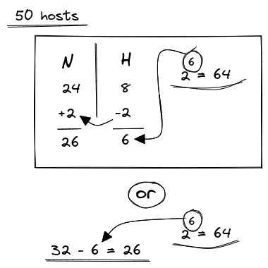
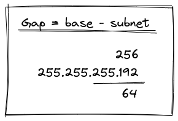
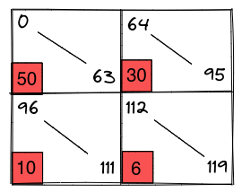

## Variable Length Subnet Mask

- **eg. 1**:  

> Number of usable hosts required = 50, 30, 10, 6  
> Network Address = 192.168.3.0/24

{width: 40%, float: right}  

Calculating for 50 hosts, we will have to reduce our 24 **H** bits by 2 to get 6 **H** bits (equals to 64 hosts).  
Then increasing the **N** bits by the same will give us 26 **N**.  

> This method can also be shortened by just reducing the total bits (32) by required **H** bits, this will give us our **N** bits.  

The subnet for 26 **N** bits is `255.255.255.192`  

Now, we can either just put the value for 6 **H** bits (64 hosts) as our initial value in the 2nd subnet block (quadrant), and calculate values for other subnets based on the differences.  

OR  
{width: 40%, float: right}  

We can also use the gap method of finding the initial subnet bit value. Subtracting those subnet value that hasn't been completed by the base value, will give us the gap value.  

Now we can just use the gap value as initial **H** bits for 2nd block gives us hosts for all blocks.  

> Using the same techniques we can find the subnet and slash value for all the required host blocks.  

Calculating for all other host blocks, we can just reduce the total bits (32) by required **H** bits, this will give us our **N** bits for each blocks.  

> **For 30 hosts**  
> 32 - 5 = 27 **N**  
> and 5 **H**  
> subnet = `255.255.255.224`  
>
> **For 10 hosts**  
> 32 - 4 = 28 **N**  
> and 4 **H**  
> subnet = `255.255.255.240`  
>
> **For 6 hosts**  
> 32 - 3 = 29 **N**  
> and 3 **H**  
> subnet = `255.255.255.248`

{width: 40%, float: right}  

Block | H value | host
---|---|---
 50 | 6 H = 64 | 0 - 63
 30 | 5 H = 32 | 64 - 95
 10 | 4 H = 28 | 96 - 111
 6 | 3 H = 8 | 112 - 119
